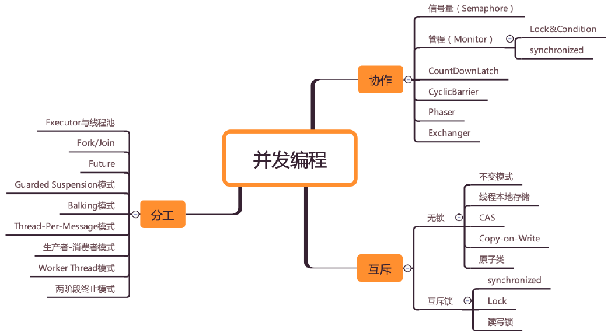

## 《Java并发编程实战-王宝令》学习笔记

## 01 开篇词

### 开篇词 | 你为什么需要学习并发编程？

```
　　信号量模型—>管道模型；
　　Doug Lea是真大神,java1.5并发包作者,也是hashmap作者之一
　　并发编程可以总结为三个核心问题：分工、同步、互斥：

　　分工指的是如何高效地拆解任务并分配给线程；Fork/Join 框架；

　　同步指的是线程之间如何协作，一个线程执行完了一个任务，如何通知执行后续任务的线程开工； Executor、Fork/Join、Future 、CountDownLatch、CyclicBarrier、Phaser、Exchanger；

　　互斥则是保证同一时刻只允许一个线程访问共享资源；可重入锁．

推荐书籍：《计算机的心智-操作系统之哲学原理》

		  《操作系统精髓与设计原理》

		  《unix操作系统设计》

		  《linux 0.11的源代码》

　　　　　《Java并发编程实战》《Java并发编程的艺术》《图解Java多线程设计模式》《操作系统：精髓与设计原理》

相关网站：http://ifeve.com＼

　　　　　http://www.cs.umd.edu/~pugh/java/memoryModel/ 
```

## 02.学习攻略

### 学习攻略 | 如何才能学好并发编程？



```
一、“跳出来，看全景”
１．建立起一张全景图。
　　并发编程领域可以抽象成三个核心问题：分工、同步和互斥：　
２．最佳的方式就是和现实世界做对比
二、“钻进去，看本质”
１．工程上的解决方案，一定要有理论做基础，技术的本质是背后的理论模型。
```

## 03-第一部分：并发理论基础 (13讲)

### 01 可见性、原子性和有序性问题：并发编程Bug的源头

```
１．Bug 的源头：CPU、内存、I/O 设备这三者的速度差异；
２．缓存（可见性问题）、线程切换（原子性问题）、编译优化（有序性问题）
３．技术在解决一个问题的同时，必然会带来另外一个问题，所以在采用一项技术的同时，一定要清楚它带来的问题是什么，以及如何规避。
```


### 02  Java内存模型：看Java如何解决可见性和有序性问题

```
一．Java 内存模型。
	站在我们这些程序员的视角，本质上可以理解为，Java 内存模型规范了 JVM 如何提供按需禁用缓存和编译优化的方法：
	volatile、synchronized 和 final 三个关键字，以及六项Happens-Before 规则，
	volatile：告诉编译器，对这个变量的读写，不能使用 CPU 缓存，必须从内存中读取或者写入．
	Happens-Before 规则：前面一个操作的结果对后续操作是可见的。Happens-Before 约束了编译器的优化行为，虽允许编译器优化，但是要求编译器优化后一定遵守 Happens-Before 规则：
	１．程序的顺序性规则：这条规则是指在一个线程中，按照程序顺序，前面的操作 Happens-Before 于后续的任意操作。
	２．volatile 变量规则：这条规则是指对一个volatile变量的写操作，Happens-Before于后续对这个volatile变量的读操作。
	３．传递性：这条规则是指如果 A Happens-Before B，且 B Happens-Before C，那么 A Happens-Before C。
	４．管程中锁的规则：这条规则是指对一个锁的解锁 Happens-Before 于后续对这个锁的加锁。（。管程是一种通用的同步原语，在Java 中指的就是 synchronized，synchronized 是 Java 里对管程的实现。管程中的锁在 Java 里是隐式实现的）
	５．线程 start() 规则：这条是关于线程启动的。它是指主线程 A 启动子线程 B 后，子线程 B 能够看到主线程在启动子线程 B 前的操作。
	６．线程 join() 规则：如果在线程 A 中，调用线程 B 的 join() 并成功返回，那么线程 B 中的任意操作 Happens-Before 于该 join() 操作的返回。
	
	final关键字：初衷是告诉编译器：这个变量生而不变，可以可劲儿优化。
```

相关参考：

1. [JSR 133 (Java Memory Model) FAQ](http://www.cs.umd.edu/~pugh/java/memoryModel/jsr-133-faq.html)
2. [Java 内存模型 FAQ](http://ifeve.com/jmm-faq/) （）
3. [JSR-133: JavaTM Memory Model and Thread Specification](https://www.cs.umd.edu/~pugh/java/memoryModel/jsr133.pdf)

### 03 互斥锁（上）：解决原子性问题

```
一.原子性问题到底该如何解决
	1.一个或者多个操作在 CPU 执行的过程中不被中断的特性，称为“原子性”，原子性问题的源头是线程切换。“同一时刻只有一个线程执行”这个条件非常重要，我们称之为互斥。
	2.锁：
	简易锁模型：加锁操作:lock()->临界区：一段代码->解锁操作：unlock()
	改进后的锁模型：把临界区要保护的资源标 R 注出来->加锁操作:lock()->临界区：资源R->解锁操作：unlock()
	3.Java 语言提供的锁技术：synchronized
```

### 04 互斥锁（下）：如何用一把锁保护多个资源？

```
一、受保护资源和锁之间合理的关联关系应该是 N:1 的关系，首先要区分这些资源是否存在关联关系。
　　对如何保护多个源：关键是要分析多个资源之间的关系。
　　如果资源之间没有关系，很好处理，每个资源一把锁就可以了。
　　如果资源之间有关联关系，就要选择一个粒度更大的锁，这个锁应该能够覆盖所有相关的资源。
　　除此之外，还要梳理出有哪些访问路径，所有的访问路径都要设置合适的锁，这个过程可以类比一下门票管理。
　　
　　“原子性”的本质是：其实不是不可分割，解决原子性问题，是要保证中间状态对外不可见。
　　细粒度锁：用不同的锁对受保护资源进行精细化管理，能够提升性能。这种锁还有个名字。
　　
　　例子：
	1.保护没有关联关系的多个资源（一个锁保护一个资源）
	银行业务:
　　　　账户类 Account
　　　　　　账户余额balance():取款 withdraw();查看余额 getBalance()
　　　　　　锁: final balLock 
　　　　账户密码 password()
　　　　　　更改密码 updatePassword() 
　　　　　　查看密码 getPassword()
　　　　　　锁： final pwLock
	可以用一把互斥锁来保护多个资源：性能太差
	2.保护有关联关系的多个资源（锁能覆盖所有受保护资源）
	银行业务:
	　　账户类 Account
	　　转账操作：账户余额balance():取款 withdraw();查看余额 getBalance()；转账操作 transfer()
	　　Account.class 作为共享的锁
```

### 05 一不小心就死锁了，怎么办？

```
一、使用细粒度锁可以提高并行度，是性能优化的一个重要手段，识别出风险很重要。
　　账本：转出账本和转入账本
　　例子：Account.class　改为细粒度锁：
　　　　锁定转出账户synchronized(this)；锁定转入账户synchronized(target)
二、使用细粒度锁可能需要复出代价：死锁
　　死锁的一个比较专业的定义是：一组互相竞争资源的线程因互相等待，导致“永久”阻塞的现象。
　　如何预防死锁：规避死锁
　　死锁的四个条件（coffman）：
　　1. 互斥，共享资源 X 和 Y 只能被一个线程占用；
　　2. 占有且等待，线程 T1 已经取得共享资源 X，在等待共享资源 Y 的时候，不释放共享资源 X；
　　3. 不可抢占，其他线程不能强行抢占线程 T1 占有的资源；
　　4. 循环等待，线程 T1 等待线程 T2 占有的资源，线程 T2 等待线程 T1 占有的资源，就是循环等待。
　　反过来分析，也就是说只要我们破坏其中一个，就可以成功避免死锁的发生：
　　１．互斥这个条件我们没有办法破坏，因为我们用锁为的就是互斥．
　　２. 对于“占用且等待”这个条件，我们可以一次性申请所有的资源，这样就不存在等待了。Allocator。
　　３. 对于“不可抢占”这个条件，占用部分资源的线程进一步申请其他资源时，如果申请不到，可以主动释放它占有的资源，这样不可抢占这个条件就破坏掉了。
　　４. 对于“循环等待”这个条件，可以靠按序申请资源来预防。所谓按序申请，是指资源是有线性顺序的，申请的时候可以先申请资源序号小的，再申请资源序号大的，这样线性化后自然就不存在循环了。
　　
　　例子：
　　Allocator：“同时申请”这个操作是一个临界区，同时申请资源 apply() 和同时释放资源 free()。
```

### 06 用“等待-通知”机制优化循环等待

```
一、等待 - 通知机制：
	用 synchronized 实现等待 - 通知机制：wait()、notify()、notifyAll()
	四要素：1. 互斥锁；2. 线程要求的条件：3. 何时等待：4. 何时通知：
	尽量使用 notifyAll()：notify() 是会随机地通知等待队列中的一个线程，而 notifyAll() 会通知等
待队列中的所有线程。
	
    例：完美的就医流程：
        1. 患者先去挂号，然后到就诊门口分诊，等待叫号；
        2. 当叫到自己的号时，患者就可以找大夫就诊了；
        3. 就诊过程中，大夫可能会让患者去做检查，同时叫下一位患者；
        4. 当患者做完检查后，拿检测报告重新分诊，等待叫号；
        5. 当大夫再次叫到自己的号时，患者再去找大夫就诊。
```

### 07 安全性、活跃性以及性能问题（总结前6章）

```
一、安全性问题
　　什么是线程安全：程序按照我们的期望执行；
　　线程安全要避免：原子性问题、可见性问题和有序性问题。
　　需要分析线性安全的问题：存在共享数据并且该数据会发生变化，通俗地讲就是有多个线程会同时读写同一数据。
　　	数据竞争（DataRace）：当多个线程同时访问同一数据，并且至少有一个线程会写这个数据的时候；
　　　竞态条件（Race Condition）：所谓竞态条件，指的是程序的执行结果依赖线程执行的顺序。
　　解决技术方案：互斥：锁。
二、活跃性问题
　　什么是活跃性问题：指的是某个操作无法执行下去。
　　死锁：阻塞（设计合适的锁）；
　　活锁：有时线程虽然没有发生阻塞，但仍然会存在执行不下去的情况：同向让路问题（随机等待时间）；
　　饥饿：线程因无法访问所需资源而无法执行下去的情况（一是保证资源充足，二是公平地分配资源（公平锁），三就是避免持有锁的线程长时间执行）。
三、性能问题
	尽量减少串行，
	阿姆达尔（Amdahl）定律：S = 1／（(1−p)+ｐ／ｎ）　【n 可以理解为 CPU 的核数，p 可以理解为并行百分比，】
```

### 09  Java线程（上）：Java线程的生命周期

```
1.通用的线程生命周期
  初始状态->可运行状态->运行状态->休眠状态和终止状态。
2.Java 中线程的生命周期(Java 语言里则把可运行状态和运行状态合并了;Java 语言里就细化了休眠状态)
　　1. NEW（初始化状态）
　　2. RUNNABLE（可运行 / 运行状态）
　　3. BLOCKED（阻塞状态）
　　4. WAITING（无时限等待）
　　5. TIMED_WAITING（有时限等待）
　　6. TERMINATED（终止状态）	 
```

### 10  Java线程（中）：创建多少线程才是合适的？

```
1.为什么要使用多线程？
　　使用多线程，本质上就是提升程序性能。
2.如何度量性能？
　　延迟和吞吐量（一个是时间维度，一个是空间维度）
3.多线程的应用场景？
　　在并发编程领域，提升性能本质上就是提升硬件的利用率，再具体点来说，就是提升 I/O的利用率和 CPU 的利用率。如果 CPU 和 I/O 设备的利用率都很低，那么可以尝试通过增加线程来提高吞吐量。
4.创建多少线程合适？（具体压测才能得到准确数据）
　　I/O 密集型计算：I/O 操作执行的时间相对于 CPU 计算来说都非常长
　　　　最佳线程数 =CPU 核数 * [ 1 +（I/O 耗时 / CPU 耗时）]
　　CPU 密集型计算：
　　　　对于 CPU 密集型的计算场景，理论上“线程的数量 =CPU 核数”就是最合适的。线程的数量一般会设置为“CPU 核数 +1”。
```

### 11  Java线程（下）：为什么局部变量是线程安全的？

```
1.局部变量不存在数据竞争?
　　在CPU 层面，是没有方法概念的，CPU 的眼里，只有一条条的指令.
2.方法是如何被执行的?
　　CPU 的工作原理:：通过 CPU 的堆栈寄存器.CPU 支持一种栈结构,这个栈是和方法调用相关的，因此经常被称为调用栈。每个方法在调用栈里都有自己的独立空间，称为栈帧，每个方法在调用栈里都有自己的独立空间，称为栈帧，每个方法在调用栈里都有自己的独立空间，称为栈帧，当调用方法时，会创建新的栈帧，并压入调用栈；当方法返回时，对应的栈帧就会被自动弹出。也就是说，栈帧和方法是同生共死的。
3.方法内的局部变量存哪里？
　　局部变量就是放到了调用栈里,局部变量是和方法同生共死的.
　　new出来的对象是在堆里，局部变量是在栈里,一个变量如果想跨越方法的边界，就必须创建在堆里。
4.调用栈与线程
　　两个线程可以同时用不同的参数调用相同的方法，那调用栈和线程之间是什么关系呢？答案是：每个线程都有自己独立的调用栈。　　
5.线程封闭
　　仅在单线程内访问数据。
　　没有共享，就没有伤害.
```

### 12  如何用面向对象思想写好并发程序？

```
１．在 Java语言里，面向对象思想能够让并发编程变得更简单。
　　一、封装共享变量
　　　　封装，封装的通俗解释就是将属性和实现细节封装在对象内部，外界对象只能通过目标对象提供的公共方法来间接访问这些内部属性．将共享变量作为对象属性封装在内部，对所有公共方法制定并发访问策略。
　　二、识别共享变量间的约束条件
　　　　共享变量间的竞态条件，一定要识别出所有共享变量之间的约束条件，如果约束条件识别不足，很可能导致制定的并发访问策略南辕北辙。
　　三、制定并发访问策略
　　　　1. 避免共享：避免共享的技术主要是利于线程本地存储以及为每个任务分配独立的线程。
　　　　2. 不变模式：这个在 Java 领域应用的很少，但在其他领域却有着广泛的应用，例如 Actor模式、CSP 模式以及函数式编程的基础都是不变模式。
　　　　3. 管程及其他同步工具：Java 领域万能的解决方案是管程，但是对于很多特定场景，使用Java 并发包提供的读写锁、并发容器等同步工具会更好。
２．宏观的原则
　　1. 优先使用成熟的工具类
　　2. 迫不得已时才使用低级的同步原语
　　3. 避免过早优化
３．性能瓶颈不是你想预估就能预估的。
```

### 13  理论基础模块热点问题答疑


------

## 04-第二部分：并发工具类 (14讲)

### 14  Lock和Condition（上）：隐藏在并发包中的管程

```
1.java SDK如何解决并发
　　Java SDK 并发包内容很丰富，包罗万象，但是我觉得最核心的还是其对管程的实现。Java SDK 并发包通过 Lock 和 Condition 两个接口来实现管程，其中 Lock 用于解决互斥问题，Condition 用于解决同步问题。

2.再造管程的理由
　　Java 语言本身提供的 synchronized 也是管程的一种实现，为什么还要在 SDK 里提供另外一种实现呢？
synchronized 申请资源的时候，如果申请不到，线程直接进入阻塞状态了，释放不了线程已经占有的资源。对于“不可抢占”这个条件，占用部分资源的线程进一步申请其他资源时，如果申请不到，可以主动释放它占有的资源。

3.如果我们重新设计一把互斥锁去解决这个问题，那该怎么设计呢？
　　1. 能够响应中断。synchronized 的问题是，持有锁 A 后，如果尝试获取锁 B 失败，那么线程就进入阻塞状态，一旦发生死锁，就没有任何机会来唤醒阻塞的线程。
　　2. 支持超时。如果线程在一段时间之内没有获取到锁，不是进入阻塞状态，而是返回一个错误，那这个线程也有机会释放曾经持有的锁。
　　3. 非阻塞地获取锁。如果尝试获取锁失败，并不进入阻塞状态，而是直接返回，那这个线程也有机会释放曾经持有的锁。

4.如何保证可见性
　　经典的范例，就是try{}finally{}，在 finally 里面释放锁。Java 里多线程的可见性是通过 Happens-Before 规则保证的。
5.什么是可重入锁
　　所谓可重入锁，顾名思义，指的是线程可以重复获取同一把锁。
6.公平锁与非公平锁
　　公平锁，唤醒的策略就是谁等待的时间长，就唤醒谁，很公平；如果是非公平锁，则不提供这个公平保证，有可能等待时间短的线程反而先被唤醒。
7.用锁的最佳实践
　　1. 永远只在更新对象的成员变量时加锁
　　2. 永远只在访问可变的成员变量时加锁
　　3. 永远不在调用其他对象的方法时加锁
```


### 15  Lock和Condition（下）：Dubbo如何用管程实现异步转同步？

```
1.Lock和Java 语言内置的管程去表？
　　Lock 有别于 synchronized 隐式锁的三个特性：能够响应中断、支持超时和非阻塞地获取锁，Java 语言内置的管程里只有一个条件变量，而 Lock&Condition 实现的管程是支持多个条件变量的，，Condition 实现了管程模型里面的条件变量。
2.那如何利用两个条件变量快速实现阻塞队列呢？
　　一个阻塞队列，需要两个条件变量，一个是队列不空（空队列不允许出队），另一个是队列不满（队列已满不允许入队），
　　Lock 和 Condition 实现的管程：await()、signal()、signalAll()
　　synchronized 实现的管程：wait()、notify()、notifyAll() 
3.同步与异步的区别？
　　通俗点来讲就是调用方是否需要等待结果，如果需要等待结果，就是同步；如果不需要等待结果，就是异步。

4.让程序支持异步，可以通过下面两种方式来实现：
　　1. 调用方创建一个子线程，在子线程中执行方法调用，这种调用我们称为异步调用；
　　2. 方法实现的时候，创建一个新的线程执行主要逻辑，主线程直接 return，这种方法我们一般称为异步方法。

5.Dubbo 源码分析
　　https://github.com/apache/incubator-dubbo
　　DefaultFuture 的路径是：incubator-dubbo/dubboremoting/dubbo-remotingapi/
src/main/java/org/apache/dubbo/remoting/exchange/support/DefaultFuture.java
```

### 16  Semaphore：如何快速实现一个限流器？

```
信号量是由大名鼎鼎的计算机科学家迪杰斯特拉（Dijkstra）于 1965 年提出，之后的15 年，信号量一直都是并发编程领域的终结者，直到 1980 年管程被提出来，我们才有了第二选择．

1.信号量模型
一个计数器，一个等待队列，三个方法:init()、down() 和 up()。
init()：设置计数器的初始值。
down()：计数器的值减 1；如果此时计数器的值小于 0，则当前线程将被阻塞，否则当前线程可以继续执行。
up()：计数器的值加 1；如果此时计数器的值小于或者等于 0，则唤醒等待队列中的一个线程，并将其从等待队列中移除。
down()、up() 这两个操作历史上最早称为 P 操作和 V操作，所以信号量模型也被称为 PV 原语。
还有些人喜欢用 semWait() 和semSignal() 来称呼它们，
在 Java SDK 并发包里，down() 和 up() 对应的则是 acquire() 和 release()。
2.如何使用信号量?
红绿灯例子：车辆在通过路口前必须先检查是否是绿灯，只有绿灯才能通行
3.快速实现一个限流器
Semaphore 可以允许多个线程访问一个临界区：各种池化资源。在同一时刻，一定是允许多个线程同时使用连接池的，当然，每个连接在被释放前，是不允许其他线程使用的。
```

### 17 ReadWriteLock：如何快速实现一个完备的缓存？

```

```

### 18  StampedLock：有没有比读写锁更快的锁？

```
Java 在 1.8 这个版本里，提供了一种叫 StampedLock 的锁，它的性能就比读写锁还要好。
1.StampedLock和 ReadWriteLock 有哪些区别？
ReadWriteLock 支持两种模式：一种是读锁，一种是写锁。
而 StampedLock 支持三种模式，分别是：写锁、悲观读锁和乐观读。
StampedLock 里的写锁和悲观读锁加锁成功之后，都会返回一个 stamp；然后解锁的时候，需要传入这个 stamp。
StampedLock 的性能之所以比 ReadWriteLock 还要好，其关键是 StampedLock 支持乐观读的方式。

“乐观读”这个词，而不是“乐观读锁”，是要提醒你，乐观读这个操作是无锁的。，如果执行乐观读操作的期间，存在写操作，会把乐观读升级为悲观读锁。
数据库里的乐观锁：版本号字段version

2.StampedLock 使用注意事项
StampedLock 的功能仅仅是 ReadWriteLock 的子集；
StampedLock 不支持重入；
StampedLock 的悲观读锁、写锁都不支持条件变量；
使用 StampedLock 一定不要调用中断操作，如果需要支持中断功能，一定使用可中断的悲观读锁 readLockInterruptibly() 和写锁 writeLockInterruptibly()。


```

### 19  CountDownLatch和CyclicBarrier：如何让多线程步调一致？

```

```

### 20  并发容器：都有哪些“坑”需要我们填？


```

```

### 21  原子类：无锁工具类的典范


```

```

### 22  Executor与线程池：如何创建正确的线程池？

```

```

### 23  Future：如何用多线程实现最优的“烧水泡茶”程序？

```

```

### 24  CompletableFuture：异步编程没那么难

```

```

### 25  CompletionService：如何批量执行异步任务？

```

```

### 26  Fork/Join：单机版的MapReduce

廖雪峰的Java多线程编程。https://www.liaoxuefeng.com/wiki/1252599548343744/1255943750561472

```

```

## 05-第三部分：并发设计模式 (10讲)

### 28  Immutability模式：如何利用不变性解决并发问题？

```
解决并发问题，其实最简单的办法就是让共享变量只有读操作，而没有写操作
不变性（Immutability）模式：所谓不变性，简单来讲，就是对象一旦被创建之后，状态就不再发生变化。

```

### 29  Copy-on-Write模式：不是延时策略的COW

```

```

### 30  线程本地存储模式：没有共享，就没有伤害

```

```

31  Guarded Suspension模式：等待唤醒机制的规范实现

```

```

### 32  Balking模式：再谈线程安全的单例模式

```

```

### 33  Thread-Per-Message模式：最简单实用的分工方法

```

```

### 34  Worker Thread模式：如何避免重复创建线程？

```

```

### 35  两阶段终止模式：如何优雅地终止线程？

```

```

### 36  生产者-消费者模式：用流水线思想提高效率

```

```

### 37  设计模式模块热点问题答疑

```

```

## 06-第四部分：案例分析 (4讲)

### 38  案例分析（一）：高性能限流器Guava RateLimiter

```

```

### 39  案例分析（二）：高性能网络应用框架Netty

```

```


07-第五部分：其他并发模型 (4讲)


