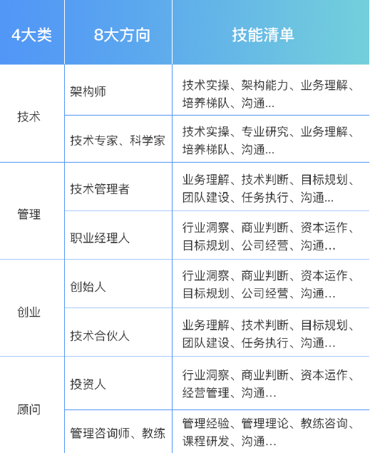
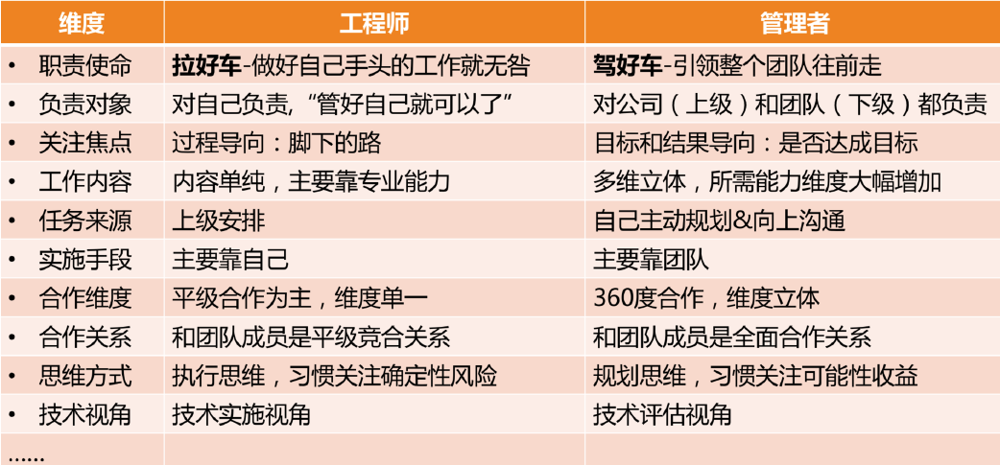

技术管理实战：

1.技术人员发展方向：

2.管理须知：
你是否主动地向自己的上级了解过团队的工作目标呢？
你是否主动关心过新同事该怎么培养，以及如何更好地帮助他们成长呢？
你是否享受去负责一个大项目的协调和推进？
它的成功发布是否会给你带来强烈的成就感呢？
你是否思考过什么样的流程和机制可以应对团队工作中的那些疏漏呢？

3.管理能带来什么？
更大的责任，更立体的视角，提升看待问题的系统性，更灵活的思维方式，更大的影响力。

4.到底什么样的人更容易走上管理岗位呢？
一、“天时”：做管理的“天时”，其实就是机会、时机、大环境、时代背景。
二、“地利”：做管理的“地利”，就是你的优势、能力，以及你所负责的工作内容。
三、“人和”：做管理的“人和”，就是你能否得到他人的支持。

5.技术管理人员如何看待技术？
首先，把技术提到更高视角来看待。你会把技术作为一个手段来看待，看它究竟能为目标带来什么。只是更关心更大的目标和整体结果了。
其次，换一种学习方式来掌握技术。但是作为 leader，你需要快速掌握更多的技术，并且快速判断该如何搭配使用，
所以你一定得有更高效的学习方式才行。1. 建立你的学习机制。2. 请教专家。3. 共创。
最后，工作视角也要做如下的升级，从目标出发去看待技术。其次，从评估的角度去看待技术。最后，从借助自己的技术到借助大家的技术。

6.技术管理者如何提高技术判断力和技术评估能力？
第一个维度是结果评估。事关每项工作的效果和业绩，在事先就要明确如何验收，这样才能让大家有的放矢，以终为始。
第二个维度是可行性评估。可行性有两层含义：
　　一是“能不能做”：
　　二是“值不值得”：成本收益问题：“人财物时”等资源投入成本，维护成本，机会成本，协作成本。
第三个维度是风险评估。

1. 建立技术学习机制。盘点你负责的业务，需要哪些方面的技术，成立一个或几个核心的
  技术小组，让团队对各个方向的技术保持敏感，要求小组定期做交流和分享，这样你就
  可以保持技术的敏感度。
2. 专项技术调研项目化。
3. 和技术大牛交流。
4. 听取工作汇报。

7.四类领导力风格？

1. 指令式管理：重事不重人，关注目标和结果，喜欢发号施令但不亲力亲为。
2. 支持式管理：重人不重事，希望带头冲锋亲力亲为，特别在意团队成员的感受，并替他们分担工作。
3. 教练式管理：重人也重事，关注全局和方向，并在做事上给予教练式辅导和启发。
4. 授权式管理：不重人也不重事，关注目标和结果，不关心过程和人员发展。

8.能力层次模型？

1. 知识，是指你知道和理解的内容和信息，一般用深度和广度来衡量。

2. 技能，是指你能操作和完成的技术，一般用熟练度来衡量。

   　　快速学习的能力、进度控制能力、沟通表达的逻辑能力、规划工作目标的能力

3. 才干，是你长期生活工作所积淀和锤炼出来的模式、特质和品格。

   　自信、前瞻、责任、热情、积极、果断、审慎、纪律、和谐、体谅、公正、完美。

   （如何识别你有哪些才干：从你之前的“成就事件”中去提取，或者从同事朋友对你的赞美中去归纳“盖洛普优势识别器 2.0”和“VIA 品格优势” ）

9.对管理的定义？

1. 古典管理理论的代表人物亨利·法约尔认为，“管理是由五项要素组成的一种普遍的人类活动，这五个要素是：计划、组织、指挥、协调和控制。”由此可以看出他特别关注管理的过程性，强调“做事”，不愧为“管理过程学派”的创始人。
2. “科学管理之父”弗雷德里克·泰勒认为，“管理就是确切地知道你要别人干什么，并使他用最好的方法去干。”他关注的焦点在于干什么，以及怎么干，有明显的目标性和方法性，强调“目标”和“做事”。
3. “现代管理学之父”彼得·德鲁克认为，“管理是一种实践，其本质不在于‘知’，而在于‘行’；其验证不在于逻辑，而在于成果。其唯一权威就是成就。”他这个说法的焦点在于实践性和结果性。众所周知，德鲁克是“目标管理理论”的创始人，尤其强调“目标”。
4. 当代管理大师斯蒂芬·罗宾斯给管理的定义是：“所谓管理，是指同别人一起，或通过别人使活动完成得更有效的过程。”这个说法的背后蕴含着管理的三个要素：人、过程和有效，用正式一点的词汇叫组织性、过程性和目标性，强调了“带人”“做事”和“目标”。

看方向、做事、带人，角色认知、管理规划、团队建设、任务管理和管理沟通五个管理要素。

10.工程师和技术管理者区别？


11.新管理者场踩的坑？
　　第一类：过程导向、被动执行；
　　第二类：大包大揽、唯我最强；
　　第三类：带头大哥、当家保姆；
　　第四类：单一视角、固化思维；
　　第五类：自扫门前雪、固守边界；
　　第六类：患得患失。


```
名言警句：
1.丹尼尔·平克在《驱动力 3.0》一书中有说：“服从让我们撑过白天，而投入才能让我们撑过夜晚。”

2.“患得患失”出自《论语》，
原文是“其未得之也，患不得之；既得之，患失之”，翻译成白话就是“还没有得到的时
候，担心得不到；而得到了之后，又担心失去”。

3.人穷则反本
这句话出自《史记•屈原列传》: “夫天者，人之始也；父母者，人之本也。 人穷则反本，故劳苦倦极，未尝不呼天 也;疾痛惨怛，未尝不呼父母也。”
翻译为：人在困苦穷尽时就会追念本原，所以到了极度劳苦困倦的时候，没有不喊天的；遇到病痛或忧伤的时候，没有不呼父母的。当人们遇到困难和挫折的时候，就想回到老路上去。

4.
```


