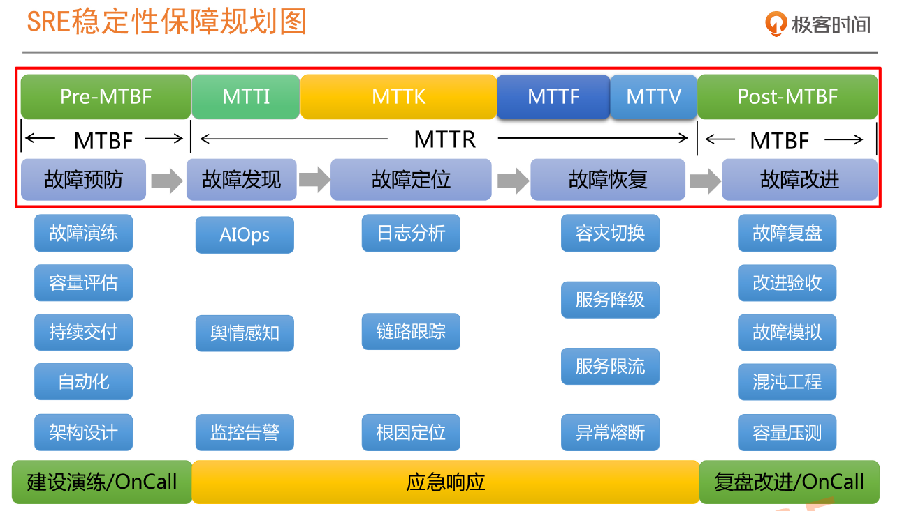
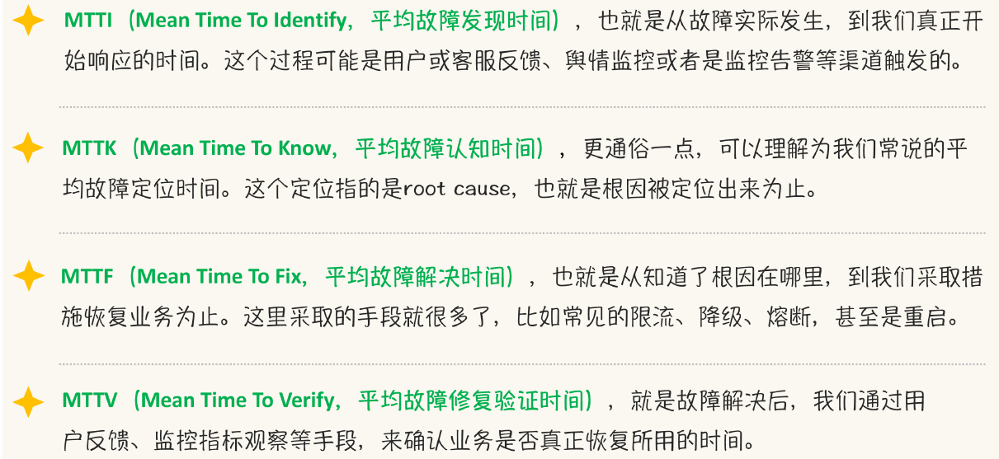

## 2020第13周：

《Spring全家桶》

Project Reactor 核心原理解析https://www.jianshu.com/p/df395eb28f69

CountDownLatch与thread.join()的区别https://www.jianshu.com/p/795151ac271b

一个带文档的商城项目：https://macrozheng.github.io/mall-learning/#/reference/idea_springboot

spring AOP 

###  Apache Commons Lang3之NumberUtils

##### 概述

> NumberUtils 是Apache封装的处理数字类型工具类，包括校验、转换、比较、计算等功能，而且方法处理失败都**不会抛出异常**，会返回默认值。

###### 一、校验功能


```java
//检查字符串是否是有效的Java数字
//isCreatable 慎用，有效数字包括进制标有0x或0X预选项，八进制数、科学记数法和标有类型限定符的数字
//所以08，09返回false，不是有效的八进制
NumberUtils.isCreatable("abc");//return false
NumberUtils.isCreatable("123");//return true
NumberUtils.isCreatable("08");//return false
NumberUtils.isCreatable("09");//return false
//检查给定字符串是否是可解析的数字
NumberUtils.isParsable("abc");//return false
NumberUtils.isParsable("001");//return true
//检查给定字符串是否是否只包含数字字符
NumberUtils.isDigits("abc");//return false
NumberUtils.isDigits("123");//return true
```

###### 二、转换功能


```java
//将一个字符串转换为int类型，失败返回0
NumberUtils.toInt("123");
//将一个字符串转换为int类型，失败返回自定义
NumberUtils.toInt("123",1);
//将一个字符串转换为long类型，失败返回0
NumberUtils.toLong("123");
//将一个字符串转换为long类型，失败返回自定义
NumberUtils.toLong("123", 2);
//将一个字符串转换为单精度浮点类型,失败返回0.0
NumberUtils.toFloat("12.3");
//将一个字符串转换为单精度浮点类型,失败返回自定义
NumberUtils.toFloat("12.3", 2.1f);
//将一个字符串转换为双精度浮点类型,失败返回0.0
NumberUtils.toDouble("2.1");
//将一个字符串转换为双精度浮点类型，失败返回自定义
NumberUtils.toDouble("2.1", 1.0d);
//将一个字符串转换为BigDecimal,默认保留2位小数,舍入模式为RoundingMode.HALF_EVEN
NumberUtils.toScaledBigDecimal("2.1");
//将一个字符串转换为BigDecimal,自定义小数位数,自定义舍入模式
NumberUtils.toScaledBigDecimal("2.1", 2, RoundingMode.HALF_UP);
```

###### 三、比较计算


```java
//获取最大最小值,支持各种类型
int[] array = {2, 4, 6, 10};
//获取数组中最小的元素,并返回
NumberUtils.min(array);
//获取数据中最大的元素,并返回
NumberUtils.max(array);
int n = 1, n1 = 4, n2 = 10;
//获取n个变量最小值
NumberUtils.min(n, n1, n2);
//获取n个变量最大值
NumberUtils.max(n, n1, n2);
//比较大小,大于返回1,等于返回0,小于返回-1
NumberUtils.compare(n, n1);
```

### 《SRE实战手册》



MTBF，Mean Time Between Failure，平均故障时间间隔。
MTTR，Mean Time To Repair， 故障平均修复时间。



GOOGLE SRE文档:https://landing.google.com/sre/workbook/toc/

https://landing.google.com/sre/resources/


在application配置文件中如何配置

spring.jpa.hibernate.ddl-auto=create-drop
可选参数 
create 启动时删数据库中的表，然后创建，退出时不删除数据表 
create-drop 启动时删数据库中的表，然后创建，退出时删除数据表 如果表不存在报错 
update 如果启动时表格式不一致则更新表，原有数据保留 
validate 项目启动表结构进行校验 如果不一致则报错

IDEA已经增加了非常方便的Stream调试功能，可以参考https://www.jetbrains.com/help/idea/analyze-java-stream-operations.html


