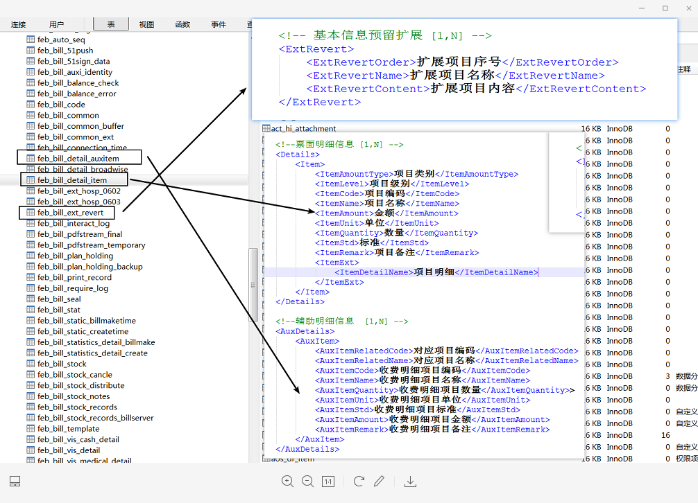

2020第25周：（0615-0621）

测试地址：
 单位端   
  内网：http://172.19.1.218:13502/zsdw_platform
  外网：http://124.127.114.22:10003/zsdw_platform/

 卫健委端 
  内网：http://172.19.1.218:13504/zsdw_kpfw
  外网：http://124.127.114.22:10005/zsdw_kpfw/

登录账号LiLL，abc123

13：30 -15：00：

```
1.开票点参照和票据参照
2.可用票据修改表

```





