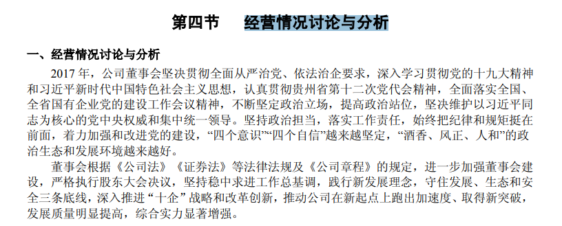

### 01 每个丈母娘都是财务专家

四表一注：

### 02 资产负债表：怎么知道你的公司“家底”厚不厚？

### 03 货币资金：钱多好，还是钱少好？

#### 流动资产：货币资金

#### 附注：合并财务报表项目注释

#### 经营情况讨论与分析

### 04 应收账款：造假者的小辫子

#### 应收账款:

1.由于会计上采用权责发生制，所以给造假者借助应收账款进行财务舞弊的机会。
2.如果应收账款的“数量”和“质量”出现了异常，基本上可以确定这个公司出现了严重的经营问题，甚至有可能虚构收入如果3.一家公司的应收账款很小甚至为0，且远远小于应付账款，大概率会是一个好公司。

### 05 应收票据：企业经营中的常见欠条

#### 应收票据:

#### 其他应收款:

### 06 存货：獐子岛的扇贝去哪儿了？

### 07 固定资产：尔康制药是怎么毁掉的？

### 08 无形资产：乐视网的无形资产之谜？

### 09 商誉世界里的人生百态

### 10 递延所得税资产：乐视网曾向税务局收税

### 11 金融资产：上市公司买股票算什么？

### 12 长期股权投资：收购了一家公司怎么算？

### 13 雅戈尔几十亿飘百亿的惊人操作（上）

### 14 雅戈尔几十亿票百亿的惊人操作（下）

### 15 负债：如何判断一家公司是否缺钱？

### 16 所有者权益：为什么上市公司热衷于高送转

### 17 营业收入：如何识别企业是否虚增收入（上）

### 18 营业收入：如何识别企业虚增了收入？（下）

### 19 毛利率：太优秀也是一种错？

### 20 营业费用：如何才能花小钱办大事？

### 21 资产减值：无处不在的“地雷”

### 22 其他经营收益：人民币贬值，航空股为何暴跌？

### 23 营业外收入：挣到这样的钱不算本事

### 24 净利润：究竟什么利润是属于你的

### 25 经营活动现金流：公司真的挣到钱了吗？

### 26 投资活动现金流：企业的投资理性吗？

### 27 筹资活动现金流：公司的钱都是从哪儿来的？

### 28 上市公司的财务肖像逃不出这8种

### 29.财务指标：给公司做个全身检查（上）

### 30 财务指标：给上市公司做一个全身检查（下）

### 31 杜邦分析：更快，更高，更强

### 32 财务实战：如何把财报读出小说的感觉来？（上）

### 33 财报实战：如何把财报读出小说的感觉来？（下）