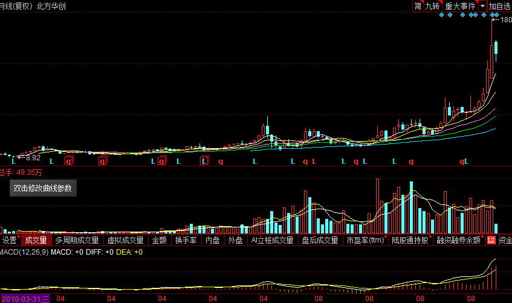

1.芯片（）

```
个股：长电科技、通富微电、华天科技、
	 北方华创、晶盛机电、至纯科技、长川科技、雅克科技、亚翔集成、耐威科技
一、重要性
二、现状
	1、国内
	(2018年)中国芯片 需求量占全球50%（有些应用的芯片，占70-80%）以上，而国产品牌芯片只能自供8%左右；去年中国进口芯片2300亿美元，属于第一大宗产品；第二名是原油，1100亿美元。芯片这么多年之所以为什么依赖进口，就是因为技术门槛太高，需要非常细分，而且每个细分领域都有各自的很高门槛，不是，随便砸钱就搞得定的；需要砸钱，砸大钱，持续砸大钱；所以VC很少投芯片的公司属于人才、技术、资金密集型，而且投入产出周期很长，风险还很高的行业。政府太重视。
	2、国际
	政治博弈加剧。
	3、半导体渗透率
	从第一款半导体集成电路芯片 发明以来，直接推动着信息技术发展，我们一共经历着3个完整的发展周期，目前正在进入第4个发展周期。
	第一个周期，上个世纪70年代到90年代，全球半导体的硅含量从6%提高到23.1%，下游需求推动的力量是PC电脑、大型机等，随后进入衰退期。
	第二个周期，2000年到2008年，全球半导体的硅含量从17.3%提高到22.4%，下游需求推动的力量是笔记本、无线2G/3G通讯 等，随后进入衰退期。
	第三个周期，2010年到2014年，全球半导体硅含量从21.1%提高到26.4%，下游需求推动的力量是智能手机 为代表的移动互联网产品，随后进入衰退期。
	目前我们即将进入第四个周期，这次硅含量的提升将突破30—35%，下游需求的推动力量是汽车 、工业、物联网 、5G 通讯等。电子并不复杂，也不难，我们过去总是听着大牌专家“玄而又玄”的所谓“创新周期”理论，究其根本，就是“半导体硅含量”的提升周期，请记住，这是半导体人的专业术语。半导体芯片是一切信息技术的基石！
三、上下游产业链分析
	高端就是上游的IP开发、设备制造、材料三个部分，这是利润率最高，也是技术门槛最高的部分，但整体市场规模并不算大。就像豪车奢侈品，利润率虽然惊人，但是从投资的角度未必有利可图。
	中端包括芯片 设计和芯片制造，这是规模最大、利润最可观的部分，缔造了英特尔、高通、台积电、三星 等一批市值千亿的巨头，以及无数的百亿美元企业。只有夺下这个山头，中国制造2025 的目标才算达成。
	低端主要是封装测试和其他的模拟电路、传感器 、分立器件 等分支行业。这些行业或者技术门槛相对较低，进入比较容易，或者市场规模相对较小，投资吸引力不大。最早的投资正是从最底层的封测行业开始的。大基金看中的三个种子选手分别是长电科技、通富微电和华天科技。尤其是长电科技，可谓是前锋部队。2015年1月，长电科技以7.8亿美元收购全球第四大的封测企业新加坡星科金朋，大基金在背后居功至伟。这一战，将长电科技从全球第六的封测行业排名，一下子推进到了前三。紧接着就是进入更上游的晶圆制造和存储器领域了。
	半导体 生产制造的三个环节中,半导体材料的发展最容易突破,追赶速度最快, 半导体制造的发展难度和追赶进度居次, 半导体设备的发展最难突破, 追赶的进度也会最慢.
	
	
```

​	A、北方华创：半导体设备龙头
​	作为A股唯一的半导体设备标的，公司是国内半导体设备领头羊，已推出了全面市场化的高端设备产品，包括Etch、PVD、氧化/扩散炉、LPCVD及清洗机等。公司也经过多年努力，成为了国内排名第二的半导体设备企业！北方华创在半导体设备产业的布局较为完善，基本覆盖了芯片制造工艺中的大部分流程，并成功引进国家集成电路产业基金 、京国瑞基金及芯动能基金等战略投资者，实现了产业与资本的融合。更为重要的是，北方华创主导产品CVD、刻蚀机、氧化炉、PVD等设备，均是我国进口价值比较高的，技术难度较大，国内竞争较小，但未来国产替代 空间也相对较大！国家集成电路产业基金占北方华创股本的7.5%，投资3000多万股。
财务指标：2017年三季报 ，营收15.5亿，营收同比增长49%，归属净利润同比增长28 %，毛利率39%。
​	B、晶盛机电：晶体硅生长设备产业龙头
是国内晶体硅生长设备产业龙头企业，主要产品分为单晶硅 生长炉、多晶硅 铸锭炉、蓝宝石 晶体炉等，占到公司营业收入的80%以上，广泛应用于半导体、光伏 、LED 等领域，目前公司业绩主要来自于光伏，半导体占比较小，未来半导体会有所扩大。晶体硅生长设备是公司立业之本，不断加码半导体设备。目前，公司已成功研发可拉制12英寸、8英寸电子级单晶硅棒，可应用于半导体产业，成为国内半导体级最大直径单晶硅生长设备，已经具备了半导体单晶硅生长和加工设备的供应能力。作为晶体硅生长设备的龙头企业，公司有望提高国产设备在半导体行业的渗透率。晶盛机电是推荐标的中业绩好估值低的企业。
财务指标：2017年三季报，营收12.6亿营收增长87%，扣非净利润增长106%，毛利率35%。
​	C、至纯科技：高纯工艺系统龙头
公司专注于高纯工艺系统，成为高纯工艺系统龙头。主要为先进制造业企业提供高纯工艺系统的整体解决方案，应用行业主要包括泛半导体产业（集成电路、平板显示、光伏、LED等）、光纤 、生物制药和食品饮料 行业等需要对工艺流程进行制程污染控制的产业。2014至今，随着国家愈发重视半导体产业发展，公司再次前瞻性布局新领域，经营业绩也进入了爆发期。2017上半年半导体整体行业实现突破，公司实现营业收入1.58亿元，同比增长46%，其中半导体设备收入8026万元，占比超过50%；实现净利润2500万元，净利率维持在16%的高水平。
财务指标：2017年三季报，营收2.25亿，营收增长26 %，扣非净利润增长20%，毛利率37 %。
​	D、长川科技：半导体检测
自成立以来一直专注于半导体检测设备领域，主要产品包括检测机和分选机等，合计占主营业务收入的96%。公司提出打造中国集成电路测试设备领军品牌的目标。集成电路的测试主要包括芯片设计中的设计验证、晶圆制造中的晶圆检测和封装完成后的成品测试。国家集成电路产业基金占北方华创股本的7.5。
财务指标：2017年三季报，营收0.99亿，营收增长70%，净利润增长78%，毛利率58 %。
​	E、雅克科技：半导体材料龙头
1、从2016年开始，通过连续3起并购，已经基本坐实了国内最大半导体材料公司的地位。
2、雅克是大基金直接参股的第一家材料类上市公司。
3、背倚强大的股东资源有助于公司成功对接中国市场红利，同时公司作为大基金在集成电路材料方面的平台是国家实现2020年国内芯片自给率40%、2025年70%战略目标不可或缺的部分，将获得持续投入。
​	F、亚翔集成：半导体工程龙头
1、国内半导体和面板处于产业风口，下游强劲需求带动600亿洁净室工程需求。
2、洁净室工程作为半导体和面板行业的前期投资将最先受益，公司以20%以上的市占率充分享受行业高增长红利。
3、半导体和面板行业的洁净室壁垒极高，目前亚翔在国内唯一具备化学分析与空气采样技术，在良率提升领域首屈一指
4、国内“缺芯少屏”现象逐步改善，技术实力和行业经验为亚翔带来充沛订单。今年上半年，公司接洽争取中的洁净室项目超过10个以上，相比去年有巨大提升,包括但不限于安徽长鑫7.7亿订单、福建晋华储器生产线4.5亿订单等。
​	G、华天科技：封装龙头
1、全球集成电路产能加速向中国转移，国内封装行业将形成产能瓶颈而深度受益。
2、公司是中国集成电路封测龙头企业之一，昆山、西安、天水三厂全面布局，已具备为客户提供领先一站式封装的能力。
3、公司借助并购的FCI、迈克光电、纪元微科三家公司，立足欧美市场。
4、17年前三季度实现营收53亿元，同比增长33.5%，净利润3.9亿元，同比增长33%。其中三季度单季度公司实现收入20亿元，同比增长33%，创出历史新高。
​	H、耐威科技：物联网芯片的龙头
1、长期从事惯性、卫星、组合导航业务,通过内生和外延发展，形成导航、 MEMS(微机电系统) 以及航空电子三大支柱产业。
2、公司导航和航空电子产品主要应用于国防领域和民用航空领域，是优质的军民融合型企业。
3、公司 MEMS 业务包括工艺开发和晶圆制造,拥有多种传感器、器件、基本结构模块的制造能力，是全球领先的 MEMS 代工企业。
4、非公开发行股票申请获得证监会发行审核委员会审核通过， 国家集成电路基金参与定增，在国家对集成电路产业自主化发展大力支持的背景下， MEMS 业务有望迅速发展壮大。

