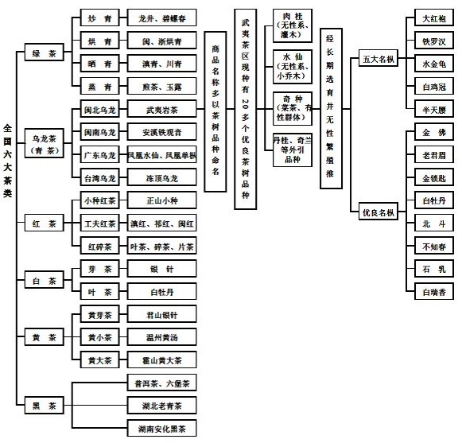

### 1.绿茶

### 2.红茶


```
英红9号: 味道兰花香和红薯香，用85-95度开水，盖碗，冲泡，没有杂味，比较好喝。
```

广东红茶出名的产品就是**清远英德英红9号**，韶关地区的**雪花岩**和**猴采红**系列，广茶公司的**金帆牌荔枝**红茶，

**英红9号**现在推了很多新牌子，我推荐**鸿雁牌**，他是9号的真正开始的地方，不论清饮还是调配，都是上佳之选，价格便宜，强推，价格便宜，就是包装还是80年代包装，不太上档次，不适合送人，或许这也是没落的原因之一。


韶关地区茶是**小种**，**果蜜香**，价格实惠品质好，没有假货，农残控制很好。

**金帆荔枝茶**还是到澳门香港买，30人民币可买250g出口品质，但是是有缺陷的茶，微酸，清饮加糖才行，适合下午喝，加生姜末，味道奇佳，食在广东当仁不让，但不适合老茶客。

其次推荐的茶就是贵州贵天下的**遵义红**，一级品质铁罐20块/50g，你别看便宜，滋味香醇，不可小觑，现在我家待客已经全部换成贵州茶，便宜，质量好，只是没有故事讲。

**猴王牌红茶**原来是11块/100g，后来倒闭了，现在中茶接手，价格变成9块，味道相去甚远，今年家里搞装修，给装修工人喝完了，很心痛，传统好东西就如此了！

**凤牌**已涨价，那个价位我觉得可以买国外品牌的，**mackwoods**红茶客必须要经历过的品牌，非常棒，在斯里兰卡本地买价格也不贵，真的是非常好，锡兰红茶珍宝，难忘，建议去旅游的时候去买，作为常饮不推荐，因为没有可靠的渠道来源。接下来推荐**山尔堂的银骏眉**，为什么不推金骏眉，因为那个价格，不好是没有理由的，而山尔堂的银骏眉是三家著名桐木关企业里最便宜的最少价格曾经到过110/50g，价格味道非常平衡的产品，是国内中高端红茶最适合入门的茶叶，进阶非常合适，无论是待客亦或者是自饮，足够好了。**祁门红茶**作为世界级的红茶，没有不推的理由，知乎上有许多卖茶的，我自己买过很多，有好有坏，但是在国内是很难买到上好的，要买品牌的顶尖产品，那还不如直接**正山堂的特制金骏眉**呢！

3.黄茶

4.白茶

5.黑茶

6.青茶

------

- 发酵茶是可以存放的，而生茶最好是即时就喝，过期就坏！